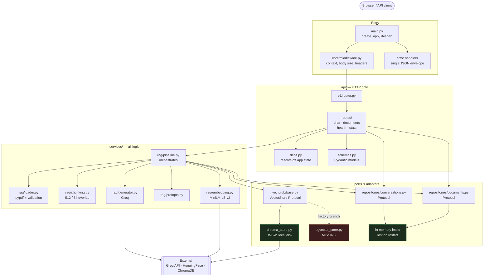
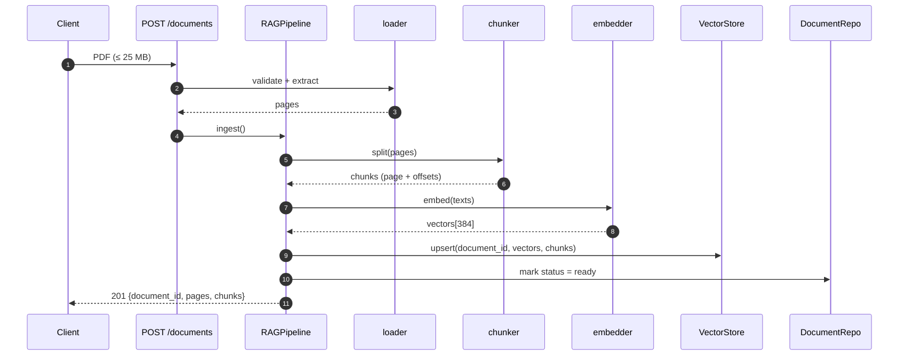
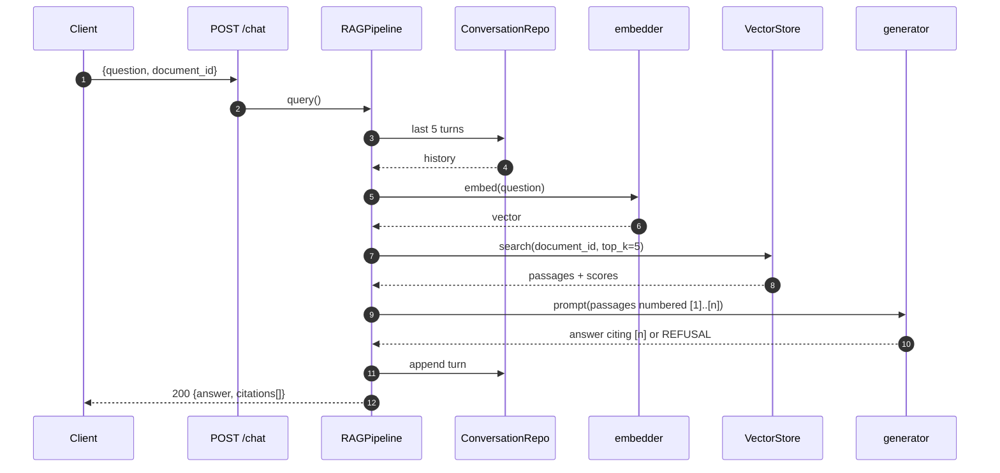

# Project structure

Two views: the directory layout, and the dependency direction that makes it
testable. The second is the one that matters when deciding where new code goes.

## Directory layout

```text
.
├── app/
│   ├── main.py                  application factory, lifespan, error handlers
│   │
│   ├── api/                     HTTP layer — no business logic
│   │   ├── deps.py              resolves singletons off app.state
│   │   ├── schemas.py           Pydantic request/response models
│   │   └── v1/
│   │       ├── router.py        aggregates route modules under /api/v1
│   │       └── routes/
│   │           ├── chat.py        POST /chat, POST /chat/reset
│   │           ├── documents.py   POST/GET/DELETE /documents
│   │           ├── health.py      GET /health, /health/ready
│   │           └── stats.py       GET /stats
│   │
│   ├── core/                    cross-cutting concerns
│   │   ├── config.py            pydantic-settings, validated env
│   │   ├── logging.py           structlog, JSON in production
│   │   ├── errors.py            AppError hierarchy + error codes
│   │   ├── context.py           request_id binding
│   │   └── middleware.py        request context, body size, security headers
│   │
│   ├── repositories/            persistence boundary
│   │   ├── documents.py         DocumentRepository (Protocol + in-memory)
│   │   └── conversations.py     ConversationRepository (Protocol + in-memory)
│   │
│   └── services/                all real logic lives here
│       ├── rag/
│       │   ├── pipeline.py      orchestrates ingest + query
│       │   ├── chunking.py      RecursiveCharacterTextSplitter wrapper
│       │   ├── loader.py        pypdf extraction + upload validation
│       │   ├── embedding.py     MiniLM-L6-v2 embedder
│       │   ├── generator.py     Groq LLM client
│       │   ├── prompts.py       answer + refusal prompts
│       │   └── schemas.py       Chunk / Passage / Answer types
│       │
│       └── vectordb/            swappable store
│           ├── base.py          VectorStore Protocol + backend factory
│           └── chroma_store.py  ChromaDB (HNSW, local disk)
│                            └─ pgvector_store.py  NOT YET WRITTEN
│
│   └── static/index.html        frontend (vanilla JS)
│
├── tests/                       80 tests, 87% coverage, no network
│   ├── conftest.py              fakes: embedder, generator, vector store
│   ├── test_api.py              HTTP contract tests
│   ├── test_chunking.py         chunker + overlap invariants
│   ├── test_core.py             config, errors, middleware
│   └── test_pipeline.py         ingest/query flows with fakes
│
├── docs/
│   ├── ARCHITECTURE.md          request lifecycle, design rationale
│   └── ROADMAP.md               planned work
│
├── scripts/smoke.py             end-to-end against live providers
├── Makefile                     test / lint / coverage / dev targets
├── pyproject.toml               ruff + pytest config
├── requirements.txt             runtime
├── requirements-dev.txt         runtime + test/lint
└── .env.example                 every option, documented
```

## Dependency direction

Dependencies point strictly inward. Nothing in `services/` imports from `api/`,
which is exactly what lets the pipeline be tested without HTTP and the store be
swapped without touching callers.



## Ingest vs. query

The two flows are asymmetric: ingest writes to every store, query reads from
most of them and calls out to the LLM.





## Two things the diagram makes obvious

**The pgvector branch is a promise, not a feature.** `base.py:43` dispatches on
`VECTOR_STORE_BACKEND` and `config.py:87` validates the value, but
`pgvector_store.py` does not exist — setting that variable raises `ImportError`
at startup. The dashed node is deliberate.

**Persistence is the same story.** Both repositories are Protocols with
in-memory implementations, so state is lost on restart and cannot be shared
across workers. The Postgres work replaces the two in-memory nodes and fills in
the dashed one; nothing above that line changes, because the Protocols are
already the seam.
